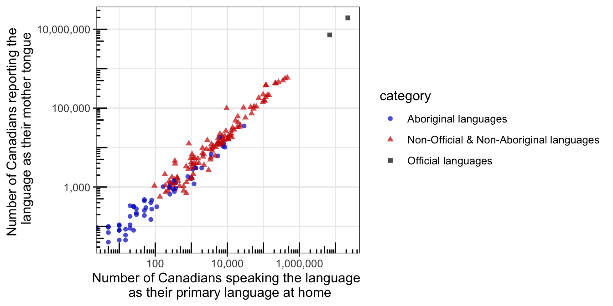

<!-- README.md is generated from README.Rmd. Please edit that file -->

# canlang <a href='https://ttimbers.github.io/canlang'></a>

<!-- badges: start -->

[](https://github.com/ttimbers/canlang/actions)
[](https://github.com/ttimbers/canlang/actions)
<!-- badges: end -->

The goal of {canlang} is to easily share language data collected in the
2016 Canadian census. This data was retreived from the 2016 Canadian
census data set using the
{[cancensus](https://mountainmath.github.io/cancensus/index.html)} R
package.

## Installation

You can install the development version from
[GitHub](https://github.com/) with:

``` r
# install.packages("devtools")
devtools::install_github("ttimbers/canlang")
```

## Example usage

The data set `can_lang` lists the counts of how many Canadians report
each language as their mother tongue, which language they speak most
often at home, which language they use most often at work, and which
language they have knowledge for. This data was recorded in the 2016
Census:

``` r
library(canlang)
head(can_lang)
#>                                  category               language mother_tongue
#> 1 Non-Official & Non-Aboriginal languages              Afrikaans         10260
#> 2 Non-Official & Non-Aboriginal languages             Akan (Twi)         13460
#> 3 Non-Official & Non-Aboriginal languages               Albanian         26895
#> 4                    Aboriginal languages              Algonquin          1260
#> 5 Non-Official & Non-Aboriginal languages American Sign Language          2685
#> 6 Non-Official & Non-Aboriginal languages                Amharic         22465
#>   most_at_home most_at_work lang_known
#> 1         4785           85      23415
#> 2         5985           25      22150
#> 3        13135          345      31930
#> 4          370           40       2480
#> 5         3020         1145      21930
#> 6        12785          200      33670
```

``` r
library(ggplot2)
ggplot2::ggplot(data = can_lang,
       aes(x = most_at_home, y = mother_tongue, 
           colour = category, shape = category)) + 
    geom_point(alpha = 0.7) +
    scale_color_manual(values = c("blue3","red3","black")) +
    scale_y_log10(name = "Number of Canadians reporting the \n language as their mother tongue", 
                       labels = scales::comma) +
    scale_x_log10(name = "Number of Canadians speaking the language \n as their primary language at home", 
                       labels = scales::comma) +
    annotation_logticks() +
    theme_bw()
```



## Plain text, excel and SQLite database files

We have included several different plain text files, an excel files and
a SQLite database file in this repo to be used for practice importing
from these filetypes. Specifically, they are:

  - [`can_lang.csv`](https://github.com/ttimbers/canlang/blob/master/inst/extdata/can_lang.csv):
    the same dataset available via `canlang::can_lang` stored as a
    vanilla `.csv` file.
  - [`can_lang-meta-data.csv`](https://github.com/ttimbers/canlang/blob/master/inst/extdata/can_lang-meta-data.csv):
    the same dataset available via `canlang::can_lang` stored as a
    vanilla `.csv` file with two rows of metadata that should be
    skipped.
  - [`can_lang.tsv`](https://github.com/ttimbers/canlang/blob/master/inst/extdata/can_lang.tsv):
    the same dataset available via `canlang::can_lang` stored as a
    `.tsv` (tab separated) file and has no column names.
  - [`can_lang.xlsx`](https://github.com/ttimbers/canlang/blob/master/inst/extdata/can_lang.xlsx):
    the same dataset available via `canlang::can_lang` stored as a
    `.xlsx` file. Can be read in using the
    {[readxl](https://readxl.tidyverse.org/)} package.
  - [`can_lang.db`](https://github.com/ttimbers/canlang/blob/master/inst/extdata/can_lang.db):
    the same dataset available via `canlang::can_lang` stored as a
    SQLite database (`.db`) file. Can be read in using the
    {[RSQLite](https://rsqlite.r-dbi.org/)} package.

## How this was made

The
[`data-raw`](https://github.com/ttimbers/canlang/tree/master/data-raw)
directory contains the the scripts necessary to create everything in
this package, including the R data objects and the plain text, excel and
SQLite database files.

## References

**Data originally published in:**

  - Source: Statistics Canada, Census of Population, 2016. Reproduced
    and distributed on an “as is” basis with the permission of
    Statistics Canada.

**Package development resources:**

  - von Bergmann, J., Aaron Jacobs, Dmitry Shkolnik (2020). cancensus: R
    package to access, retrieve, and work with Canadian Census data and
    geography. v0.3.2.
